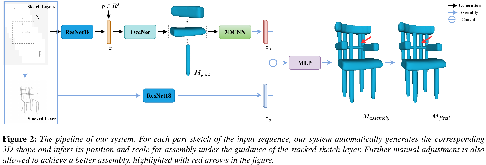

# PartSketcher [[Paper]](https://onlinelibrary.wiley.com/doi/full/10.1111/cgf.14184)[[Video]](https://www.youtube.com/watch?v=-8XBqwz7u5M)

**Learning Part Generation and Assembly for Sketching Man-Made Objects**  
Dong Du, Heming Zhu, [Yinyu Nie](https://yinyunie.github.io/), [Xiaoguang Han](https://mypage.cuhk.edu.cn/academics/hanxiaoguang/), [Shuguang Cui](https://sse.cuhk.edu.cn/en/faculty/cuishuguang), [Yizhou Yu](https://i.cs.hku.hk/~yzyu/), [Ligang Liu](http://staff.ustc.edu.cn/~lgliu/)  
In COMPUTER GRAPHICS forum (CGF), 2021.  



---

### Setup and Running

#### Dependencies


---

### Citation

If you find our work helpful, please consider citing

```
@inproceedings{du2021learning,
  title={Learning Part Generation and Assembly for Sketching Man-Made Objects},
  author={Du, Dong and Zhu, Heming and Nie, Yinyu and Han, Xiaoguang and Cui, Shuguang and Yu, Yizhou and Liu, Ligang},
  booktitle={Computer Graphics Forum},
  volume={40},
  number={1},
  pages={222--233},
  year={2021},
  organization={Wiley Online Library}
}
```

---

### License

PartSketcher is relased under the MIT License. See the [LICENSE file](LICENSE ) for more details.