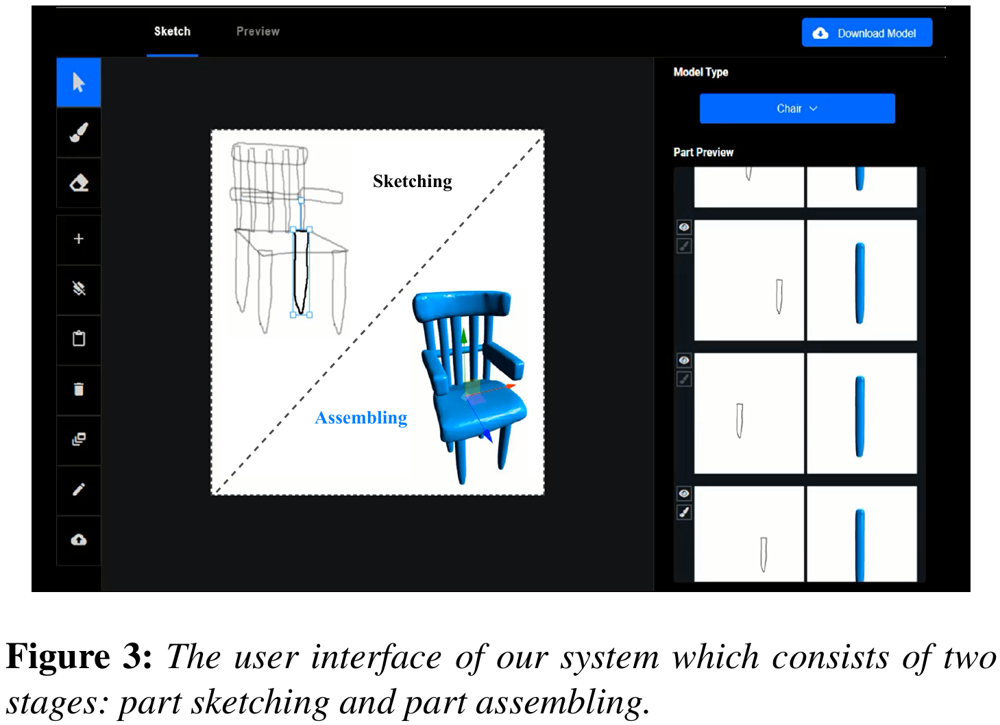

# PartSketcher [[Paper]](https://onlinelibrary.wiley.com/doi/full/10.1111/cgf.14184)[[Video]](https://www.youtube.com/watch?v=-8XBqwz7u5M)

**Learning Part Generation and Assembly for Sketching Man-Made Objects**  
Dong Du, Heming Zhu, [Yinyu Nie](https://yinyunie.github.io/), [Xiaoguang Han](https://mypage.cuhk.edu.cn/academics/hanxiaoguang/), [Shuguang Cui](https://sse.cuhk.edu.cn/en/faculty/cuishuguang), [Yizhou Yu](https://i.cs.hku.hk/~yzyu/), [Ligang Liu](http://staff.ustc.edu.cn/~lgliu/)  
In COMPUTER GRAPHICS forum (CGF), 2021.  


---

### Setup and Running

This implementation has been tested on Ubuntu 18.04, using CUDA 10.0 and Pythton 3.6.9.  

#### Dependencies
PyTorch==1.2.0  
pykdtree==1.3.4  
pymcubes==0.1.2  
numpy-stl==2.16.3  
npm==3.5.2 (for the user interface)    


#### Training  
`cd PartSketcher`  
1. `python train_gen.py`: train sketch-based part generator.  
2. `python train_ass.py`: train sketch-based part assembler.  
3. `python gen_sket2occ_dataset`: generate part shapes with the pre-trained generator.  
4. `python train_ass_finetune.py`: finetune the part assembler.  


#### Testing
`cd PartSketcher`  
1. `python test_gen.py`: test part generator.  
2. `python test_ass.py`: test part assembler.  
3. `python test_part2whole.py`: test complete shape generation with part assembly.


#### User Interface
The user interface is designed with [Vue Material Dashboard](https://demos.creative-tim.com/vue-material-dashboard). It is created by Heming Zhu. You can quickly run it following the three steps:   
Download the pre-trained [checkpoints](https://mailustceducn-my.sharepoint.com/:f:/g/personal/dongdu_mail_ustc_edu_cn/Em0t0u-KIBNAhwSLxTNsW6gB1PIsRb16VKRszGiXxLrZtA?e=ddFbJ9) and put them in `UI/part_sketch_server/checkpoint`. You can also use the models trained by yourself. 
1. `npm install`  
2. `npm run dev`  
3. `cd part_sketch_server`  
4. `python sketch_server.py`  

More introduction about Vue can be found in the [README.md](UI/README.md).  

  


#### Dataset

The pre-processed dataset can be found in this [link](https://mailustceducn-my.sharepoint.com/:f:/g/personal/dongdu_mail_ustc_edu_cn/ElaWQwnAHxBLuwPnaonFKUwBCLK58_WSGqj2dsc9Rx77wg?e=rTZJQG). You can also use [PartNet](https://partnet.cs.stanford.edu/) dataset to obtain own training data. The [scripts](https://mailustceducn-my.sharepoint.com/:f:/g/personal/dongdu_mail_ustc_edu_cn/Ev_8xr-6tR1EjQxCqO8QD6MBPjVDVyenKogWm07zkmec6w?e=ABo52c) may help you to process the source data.

---

### Citation

If you find our work helpful, please consider citing

```
@inproceedings{du2021learning,
  title={Learning Part Generation and Assembly for Sketching Man-Made Objects},
  author={Du, Dong and Zhu, Heming and Nie, Yinyu and Han, Xiaoguang and Cui, Shuguang and Yu, Yizhou and Liu, Ligang},
  booktitle={Computer Graphics Forum},
  volume={40},
  number={1},
  pages={222--233},
  year={2021},
  organization={Wiley Online Library}
}
```

---

### License

PartSketcher is relased under the MIT License. See the [LICENSE file](LICENSE ) for more details.